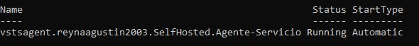
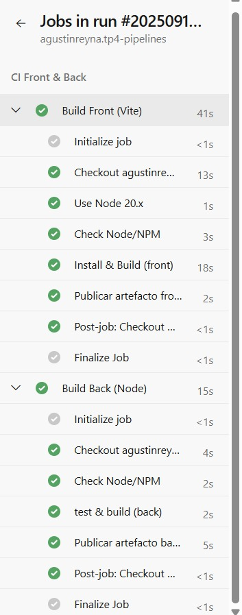
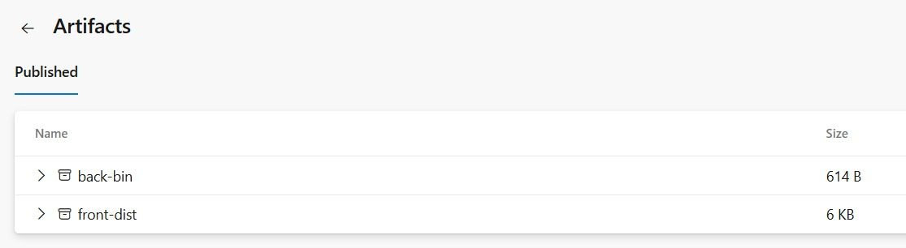

Decisiones del TP

1. Stack elegido y estructura del repo.

2. Diseño del pipeline (stages, jobs, artefactos).

3. Evidencias (capturas).

1) Stack elegido y estructura del repo

Para el trabajo se eligió un stack JavaScript/Node con aplicación mínima:

Frontend: Vite (vanilla).
-> Scripts: npm ci, npm run build (genera /dist).

Backend: Node.js + Express.
-> Scripts: npm ci, npm test (smoke), npm run build (prepara /bin).

2) Diseño del pipeline

Stage CI (Integración Continua): se ejecuta automáticamente con cada push a main.

Dentro del stage se definieron dos jobs independientes:

1. Frontend job:

Pasos: checkout → NodeTool@0 (Node 20.x) → check node/npm → npm ci → npx vite build.

Artefacto publicado: front-dist (contenido de /front/dist).

2. Backend job:

Pasos: check node/npm → npm ci → npm test → npm run build.

Artefacto publicado: back-bin (contenido de /back/bin).

3) Evidencias

